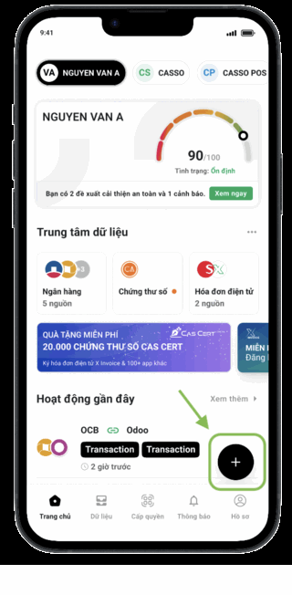
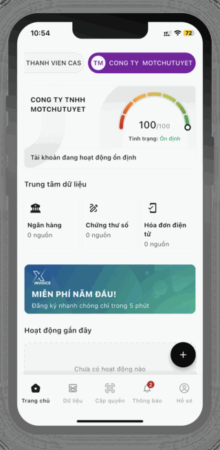

*[Read this in English](README.md)*

# KysoQR

Ký số tài liệu PDF qua mã QR (CAS e-signing) và xác minh chữ ký số điện tử — mã nguồn mở, **một ứng dụng Next.js duy nhất, hoàn toàn stateless**.

**Dùng thử ngay:** [xsign-outsource.duy-nguyen1010fight.workers.dev](https://xsign-outsource.duy-nguyen1010fight.workers.dev/) — không cần clone/cài đặt gì để xem thử trước.

## KysoQR Opensource là gì?

KysoQR là một ứng dụng ký số và xác minh chữ ký, hướng tới trở thành một công cụ **mã nguồn mở, tự host được, triển khai tối giản** không cần setup và chạy trong vài lệnh. 

Sau khi triển khai dự án, quy trình ký số của doanh nghiệp diễn ra như sau:

- Lên CAS ID (tải từ App Store hoặc CHPlay) đăng ký chữ ký số cho cá nhân (hiện tại đang miễn phí) — xem hướng dẫn từng bước bên dưới.
- Up tài liệu lên ứng dụng KysoQR
- Cấu hình phiên ký (người ký và vị trí ký) và nhấn "ký"
- Quét QR trên CAS ID để hoàn thành phiên ký

### Hướng dẫn đăng ký chứng thư số trên Cas ID

Cas ID có 2 luồng đăng ký riêng tuỳ theo loại tài khoản. Ảnh bên dưới lấy từ chính luồng đăng ký của Cas ID ([cas.so/cas-id/chu-ky-so](https://cas.so/cas-id/chu-ky-so/)).

#### Cá nhân / Hộ kinh doanh — 7 bước



1. **Thêm tài sản số** — khởi tạo luồng thêm tài sản số.
   - Tại màn hình chính Cas ID, nhấn biểu tượng dấu **[+]** để thêm liên kết mới.
   - Chọn thẻ **Cá nhân / Hộ kinh doanh**.
   - Nhấn nút **Thêm tài sản số**.
2. **Chọn dịch vụ** — chọn loại dịch vụ cần kết nối.
   - Hệ thống hiển thị danh sách các loại tài khoản và dịch vụ.
   - Tìm và nhấn chọn mục **Chứng thư số**.
3. **Gói cước** — lựa chọn gói cước.
   - Tại màn hình Thêm chứng thư số, nhấn **NHẬN NGAY** trên banner ưu đãi.
   - Chọn gói cước phù hợp (ví dụ: Gói 3 tháng – 0 VNĐ hoặc Gói 1 năm).
   - Tích chọn đồng ý điều khoản sử dụng dịch vụ, rồi nhấn **Tiếp tục**.
4. **Chữ ký** — tạo mẫu chữ ký điện tử.
   - Dùng ngón tay vẽ hoặc ký trực tiếp mẫu chữ ký vào khung trắng trên màn hình.
   - Nhấn **Tiếp tục** để chuyển sang bước tiếp theo.
5. **Định danh** — xác nhận chia sẻ thông tin định danh.
   - Kiểm tra thông tin cá nhân đồng bộ từ eKYC: họ tên, CCCD, địa chỉ.
   - Tích chọn xác nhận đã đọc và hiểu mục đích chia sẻ dữ liệu.
   - Nhấn **Xác nhận**.
6. **Thanh toán** — thanh toán gói cước.
   - Tại Chi tiết thanh toán, nhập mã giảm giá nếu có và kiểm tra đơn giá, thuế, tổng tiền.
   - Nếu cần hoá đơn GTGT, bật xuất hoá đơn và điền thông tin nhận hoá đơn.
   - Nhấn **Hoàn tất đơn hàng**, rồi chuyển khoản qua logo ngân hàng hoặc quét QR bằng Mobile Banking.
7. **Kích hoạt** — xác nhận kích hoạt chứng thư số.
   - Kiểm tra thông tin trên thẻ chứng thư: nhà cung cấp, chủ sở hữu, số seri, ngày hết hạn.
   - Nhấn **Xác nhận kích hoạt ngay**.
   - Hệ thống hiển thị "Kích hoạt thành công" — vậy là xong.

#### Doanh nghiệp — 6 bước



1. **Bắt đầu** — khởi tạo & chọn gói cước.
   - Tại màn hình chính Cas ID, nhấn **[+]** → chọn thẻ **Doanh nghiệp** → **Thêm tài sản số**.
   - Chọn doanh nghiệp cần đăng ký (hoặc xác thực thêm doanh nghiệp). Người thực hiện phải là đại diện theo pháp luật.
   - Chọn **Chứng thư số**, nhấn **Đăng ký ngay** trên banner Intrust, chọn gói cước và **Tiếp tục**.
2. **Hồ sơ** — khai báo thông tin yêu cầu đăng ký.
   - Kiểm tra thông tin doanh nghiệp đồng bộ: mã số thuế, tên, địa chỉ, trạng thái MST.
   - Tải lên Giấy phép kinh doanh (PDF/DOCX/JPG/PNG, tối đa 2MB) và nhập email nhận thông tin.
   - Đồng ý sử dụng thông tin để cấp chứng thư số và Thoả thuận Intrust CA, rồi **Xác nhận**.
3. **eKYC** — xác thực định danh eKYC.
   - Nhấn **Bắt đầu**; chụp mặt trước và mặt sau CCCD gắn chip theo khung hướng dẫn.
   - Chạm mặt sau CCCD vào khu vực NFC, giữ cố định rồi xác thực khuôn mặt.
   - Khi hệ thống báo "Trùng khớp", nhấn **Hoàn tất** để gửi yêu cầu.
4. **Thanh toán** — thanh toán gói cước.
   - Khi hồ sơ được duyệt, mở thông báo trên Cas ID (trạng thái Chờ thanh toán).
   - Nhập mã giảm giá nếu có; xuất hoá đơn GTGT nếu cần.
   - Thanh toán qua chuyển khoản hoặc QR Mobile Banking.
5. **OTP & PIN** — kích hoạt & thiết lập mã PIN ký số.
   - Trạng thái chuyển sang "Chờ kích hoạt" — nhấn **Tiếp tục**.
   - Nhập mã OTP 6 số gửi về số điện thoại đăng ký.
   - Tạo mã PIN ký số 6 chữ số và nhập lại để xác nhận.
6. **Hoàn tất** — hoàn tất đăng ký.
   - Hệ thống hiển thị "Đăng ký thành công".
   - Chứng thư số Intrust CA được tích hợp vào hồ sơ doanh nghiệp trên Cas ID và sẵn sàng ký số từ xa.

## Tại nào nên sử dụng ứng dụng này để triển khai ký số cho doanh nghiệp?
 
- **Triển khai hệ thống ký số cho nội bộ nhanh chóng và miễn phí** - clone về, cài dependency, tạo `.env`, chạy một lệnh là dùng được ngay.

- **Xác minh hầu hết các hợp đồng có chữ ký số ở Việt Nam** — dùng thuật toán có sẵn trong ứng dụng để kiểm tra chữ ký có trong hợp đồng có phải do đúng chủ private key tạo ra, không phải chỉ so sánh vài trường dữ liệu tự khai.

- **Mã nguồn mở, minh bạch** — ai cũng đọc được và tự kiểm chứng được logic xác minh, không phải tin vào một hộp đen.

- **Tối giản hạ tầng** — một dịch vụ ký số/xác minh không cần giữ trạng thái ở server thì không nên bắt người vận hành phải dựng cả một cụm hạ tầng (DB + queue + cache) chỉ để chạy nó.


## Kiến trúc tóm tắt

Hai luồng độc lập, cùng một repo, server hoàn toàn stateless (không ghi file, không giữ session giữa các request):

- **Ký số** (CAS-driven) — `POST /api/sign/request` gửi tài liệu + vị trí chữ ký sang CAS → poll `GET /api/sign/status` → khi hoàn tất, tải bản đã ký về qua `GET /api/sign/download`. Trạng thái phiên ký chỉ tồn tại ở `localStorage` của trình duyệt.
- **Xác minh** (document-driven) — `POST /api/verify/upload` xác minh chữ ký số thật (chữ ký + chain + trust anchor), độc lập hoàn toàn với CAS/database. `GET /api/verify/signing-round/[orgIdSigned]` là tra cứu nhanh qua CAS cho tiện, không thay thế cho verify-by-upload.
- CAS được trừu tượng hoá qua một interface `CasProvider`, hiện có 1 implementation thật (`CasEsignProvider`) — gọi thẳng API CAS e-signing, không có chế độ giả lập.

## Cách chạy dự án

### 1. Local — máy cá nhân, phát triển/thử nghiệm

```bash
git clone https://github.com/KysoQR/KysoQR
cd KysoQR
npm install
cp .env.example .env
npm run dev
```

Không cần cài database, Redis, hay bất kỳ service ngoài nào — mở `http://localhost:3000` là chạy được ngay. Luồng **xác minh chữ ký** hoạt động ngay lập tức, không cần credential nào. Luồng **ký** cần điền `CAS_ESIGN_BASE_URL`/`CAS_ESIGN_CLIENT_ID`/`CAS_ESIGN_API_KEY` vào `.env` trước (không có default nào được hardcode sẵn trong source — xem mục ["Env người dùng cần"](#env-người-dùng-cần) phía dưới nếu muốn dùng thử ngay bằng key demo dùng chung). Root CA tin cậy dùng để xác minh chữ ký không cấu hình qua env — đã bundle sẵn trong [`lib/trustStore/roots/`](lib/trustStore/roots/README.md).

### 2. Server — tự host trên máy chủ/VPS riêng

Về bản chất vẫn là một tiến trình Node.js duy nhất, không cần DB/Redis — chỉ khác Local ở chỗ chạy bản build production thay vì dev server:

```bash
npm install
cp .env.example .env   # điền 3 biến CAS_ESIGN_* thật
npm run build
npm run start
```

Khuyến nghị: đặt sau reverse proxy (Nginx/Caddy) để có TLS; đảm bảo `.env` không lộ ra ngoài (quyền file, không phục vụ tĩnh); không log PII.

Hướng dẫn chi tiết từng bước (cài Node, systemd service, Nginx + TLS, cập nhật code): [`docs/DEPLOY.md`](docs/DEPLOY.md).

### 3. Cloud Worker — nền tảng serverless/edge

Kiến trúc được thiết kế sẵn cho mô hình này: server hoàn toàn stateless, không ghi file hay giữ trạng thái trong tiến trình, mọi cấu hình đọc qua biến môi trường/secrets của nền tảng.

Đã dùng được **ngay hôm nay** trên các nền tảng serverless/container có Node.js runtime đầy đủ (ví dụ: Vercel serverless functions ở chế độ Node runtime, AWS Lambda container image, Fly.io Machines, Railway...) — set biến môi trường qua secrets manager của nền tảng đó, cách vận hành giống hệt mục "Server" ở trên.

**Đã verify chạy được trên Cloudflare Workers** (runtime edge/isolate thuần, không có filesystem thật) qua OpenNext Cloudflare adapter (`nodejs_compat`, cho phép `node-forge`/`Buffer` chạy được). Có 1 điểm khác biệt quan trọng cần biết: `lib/trustStore/` (đọc chứng thư CA) dùng thêm 1 manifest sinh sẵn lúc build (`lib/trustStore/generated/*.generated.ts`, xem [`lib/trustStore/roots/README.md`](lib/trustStore/roots/README.md)) vì Cloudflare Workers không có filesystem thật để đọc file lúc runtime như VPS. Hướng dẫn chi tiết: [`docs/DEPLOY_CLOUDFLARE.md`](docs/DEPLOY_CLOUDFLARE.md).

## Lệnh

| Việc       | Lệnh                |
| ---------- | ------------------- |
| Dev server | `npm run dev`       |
| Build      | `npm run build`     |
| Test       | `npm test`          |
| Lint       | `npm run lint`      |
| Format     | `npm run format`    |
| Type-check | `npm run typecheck` |

## Đóng góp / quy tắc làm việc

Quy tắc cố định khi đóng góp code (Definition of Done, khi nào bật Plan Mode, Verification Loop bắt buộc sau mỗi lần sửa code): [`Rule/RULES.md`](Rule/RULES.md). Bắt buộc đọc trước khi code.

## License

Phát hành theo giấy phép **MIT** — xem [`LICENSE`](LICENSE).

## Trạng thái

Dự án đang trong giai đoạn hiện thực — luồng ký số đã chạy được đầy đủ; luồng xác minh chữ ký số đang được hiện thực dần (một số route/UI vẫn ở dạng khung, chưa hoàn thiện business logic).

## Env người dùng cần

```
NODE_ENV="production"
CAS_ESIGN_BASE_URL=https://production.bankhub.dev
CAS_ESIGN_CLIENT_ID=trial-vendor-47de-86e8-7342f311028c
CAS_ESIGN_API_KEY=a0e6d612-b34e-11f1-a10d-02cf4c5ff398
```

Lưu ý: đây là các key **trial** dùng chung để bạn dùng thử ngay. Nếu muốn sử dụng để ký thật hằng ngày hoặc đóng gói thành sản phẩm production, cần truy cập trang https://cas.so/ hoặc liên hệ sđt 0961580977 để được cấp key riêng.